[comment]: <> (# Individual-Undergraduate-Project)

[comment]: <> (  ## Undergraduate Individual Project, Third Year of Computer Science)

[comment]: <> (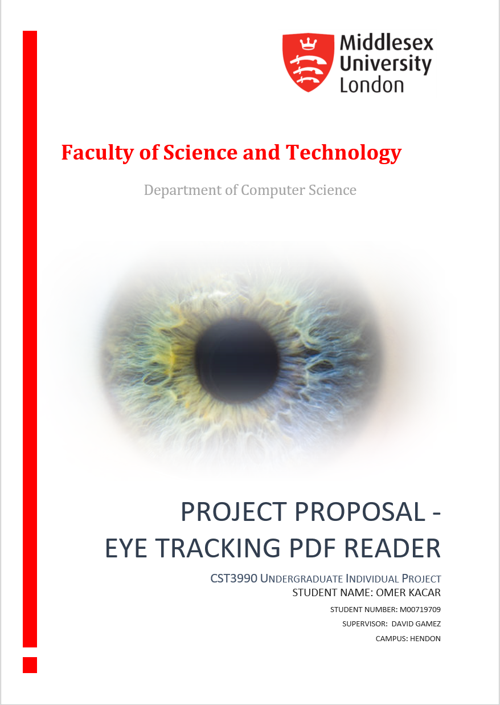)

[comment]: <> (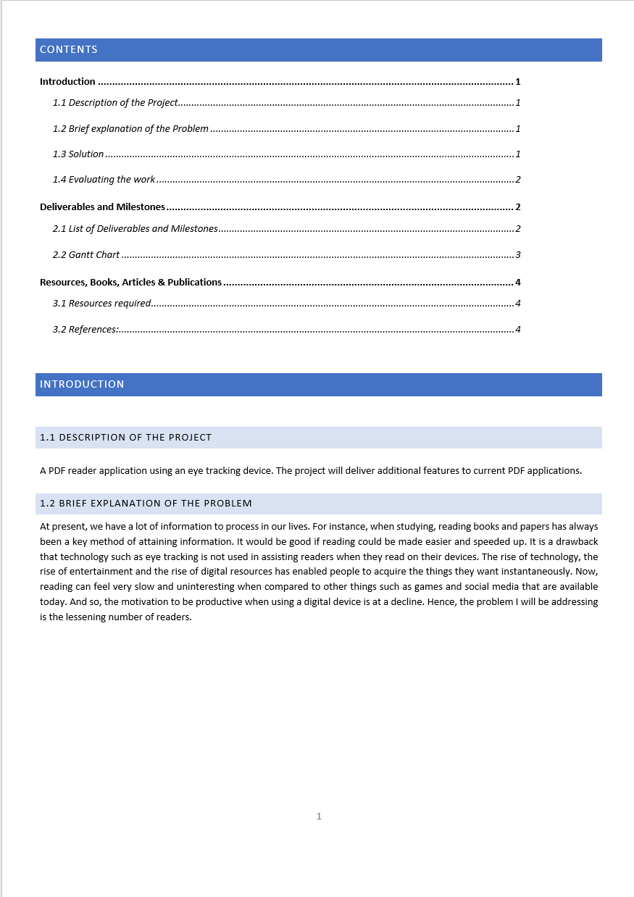)

[comment]: <> (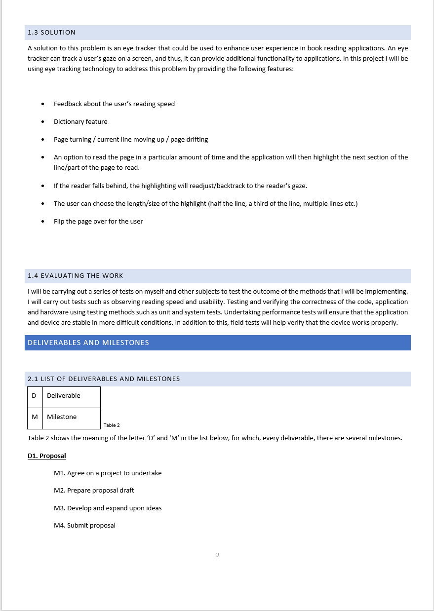)

[comment]: <> (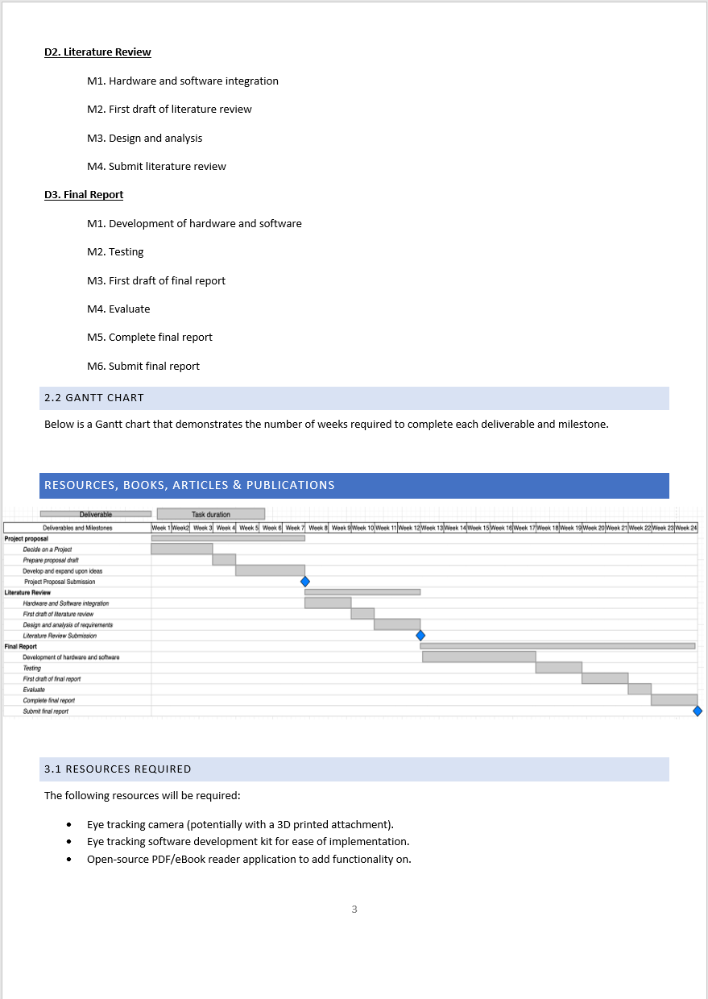)

[comment]: <> (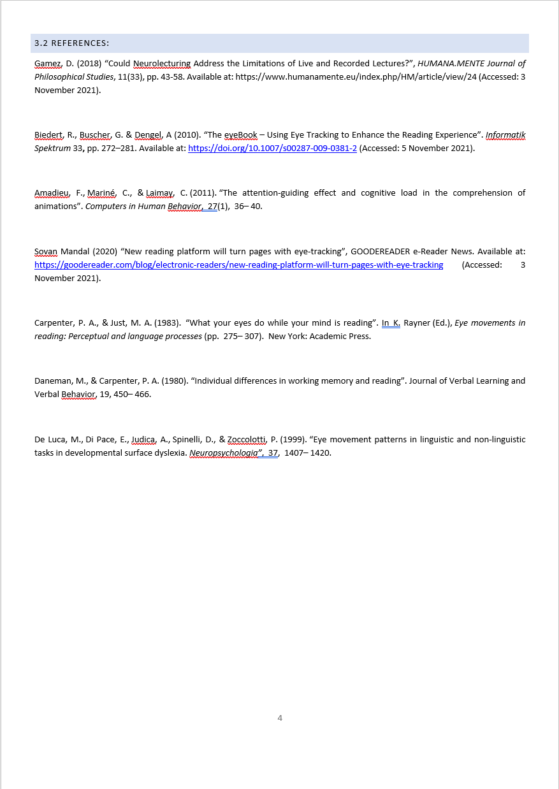)

# LITERATURE REVIEW

# EYE TRACKING PDF READER

CST3990 Undergraduate Individual Project

STUDENT NAME: OMER KACAR

STUDENT NUMBER: M00719709

SUPERVISOR:  DAVID GAMEZ

CAMPUS: HENDON

# Contents

**[1 Introduction ]()**

**[2 Literature review ]()**

**[2.1 Psychology on Reading ]()**

**[2.1.1 Rapid Serial Visual Presentation (RSVP)]()**

**[2.1.2 Speed Reading Courses ]()**

**[2.2 Reading Skill Improvement Applications ]()**

**[2.2.1 ReaderPro - Speed Reading and Brain Development ]()**

**[2.2.2 Speed Reading – Brain Training ]()**

**[2.2.3 eyeBook ]()**

**[2.2.4 RSVP on the Go ]()**

**[2.3 Accessibility with Eye Tracking]()**

**[2.3.1 Tobii Dynavox ]()**

**[2.3.2 Tobii EdTech ]()**

**[2.4 Eye Tracking Without a Dedicated Eye Tracking Device ]()**

**[2.4.1 SeeSo ]()**

**[2.4.2 GazeRecorder ]()**

**[2.4.3 EyeWriter ]()**

**[2.5 Eye Tracking Technology ]()**

**[2.5.1 Outline ]()**

**[2.5.2 Glasses ]()**

**[2.5.3 Monitor and Eye Tracker Unit ]()**

**[2.5.4 Camera ]()**

**[2.5.5 DIY Eye Tracker]()**

**[2.5.6 Tobii Eye Tracker 5]()**

**[2.5.7 Summary]()**

**[3 References]()**

**[4 Interim Progress Report]()**

**[4.1 Picture of the Eye Tracker]()**

**[4.2 Website and Current reader]()**

**[4.3 Database Design]()**

**[4.4 Literature Review and Research]()**

# 1 Introduction

Learners who read slowly are typically (1) fixating frequently, (2) spending a long time on each fixation, and (3) looking back frequently at what they have already read (Nation, 2005). Speed reading practice can be a way of overcoming these obstacles to reading fluency (Mihwa Chung, 2006). A speed-reading book provides methods to read faster, apps let one learn speed reading methods interactively, and eye tracking devices are available to aid in reading. Based on both reading speed and comprehension assessments, readers read an average of 200 words per minute (wpm) with good comprehension, and this can be significantly improved with simple assistive devices, books, and applications. While there are assistive eye tracking applications for reading, they primarily focus on highlighting or page turning and do not offer much speed-reading support for maximising speed reading and comprehension simultaneously. Now, technology for eye tracking has progressed rapidly in recent years and eye tracking devices can precisely determine where the user&#39;s eye is looking. Eye tracking today can be done using numerous devices such as a web camera, or from a small device to fix to your computer that are unobtrusive. In this way, eye gaze data allows for new kinds of applications. Several researchers and commercial groups have also worked&#39; on this technology, and there is an increasing demand for such devices on the market. To address the slow reading speed of users, eye tracking technology will be used since it can track the user&#39;s gaze and provides functionality that won&#39;t obstruct the user while reading. There is a literature review in the next section, in which, a variety of research methods, reading assistance devices and eye tracking technology will be discussed.

# 2 Literature review

## 2.1 Psychology on Reading

### 2.1.1 Rapid Serial Visual Presentation (RSVP)

The RSVP method allows a reader to maintain fixation at a specific location on the screen as words are presented in quick succession, eliminating the need for eye movements ( (Forster, 1970), (Potter, 1993)). The RSVP method uses a series of words presented over a hundred milliseconds (this duration varies across studies). (Potter, 1980) Found that participants were more capable at this task when the words were related compared to when the words were unrelated or scrambled.

For instance, (Masson, 1986) presented the final word of each sentence in uppercase letters and until the reader said the word aloud, the word remained on the screen. According to Masson, readers were more likely to identify the final word when the context of the sentence was predictable (i.e., &quot;He mailed the letter without a STAMP&quot;), both when making lexical decisions about the words and when reading them aloud. And thus, predictability makes a significant difference in reading speed and comprehension.

While RSVP readers can properly comprehend shorter texts, this does not necessarily mean that they can comprehend longer ones. An article in a newspaper or a book chapter, for instance, requires the reader not only to understand individual sentences, but also to construct a mental model of the entire document.

### 2.1.2 Speed Reading Courses

When reading English, forward saccades last an average of 20 to 35 milliseconds and cover seven letters (Rayner, 2016). There is a strong correlation between the distance travelled and the variation in fixation durations rather than with cognitive and linguistic variables. In about 30% of the cases, readers skip the next word and move on to the next (Rayner.K, 2009). The possibility of skips increases with the word&#39;s shortness, frequency, and predictability from the previous context. The word _the_ has these characteristics and is skipped around 50% of the time (Angele, 2013). Nevertheless, even though a word might have been skipped, it does not necessarily mean that it was not processed(Rayner, 2016).

Since Evelyn Wood introduced Reading Dynamics training in 1959, in which she introduced ways of multiplying the reading speed of users, speed reading has been around for decades. Speed Reading has recently increased in popularity, with speed-reading apps and technologies being introduced for smartphones and digital devices (Rayner, 2016). Prior to and after speed-reading classes, participants are often tested on their comprehension. For instance, reading at 2,000 words per minute and scoring 60% on the comprehension test would result in a Reading Efficiency Index (RE Index) of 1,200 words per minute (2,000 times 0.60). An individual who reads at 5,000 words per minute but understands nothing (i.e., answers the comprehension questions at only 10%) would receive an RE Index score of 500 words per minute (Carver, 1990).

## 2.2 Reading Skill Improvement Applications

### 2.2.1 ReaderPro - Speed Reading and Brain Development

ReaderPro is an application available on the Google Play Store. Users can choose from a wide range of reading materials available on the app. The user is given a reading time that can range from 5 to 60 minutes depending on the user&#39;s reading ability, and an assessment of reading comprehension and a score follows the reading. As a result of ReaderPro, users can train their reading speed to overcome their lack of interest in reading (Hayatun, 2019).

### 2.2.2 Speed Reading – Brain Training

Using this application users can learn how to speed read any text successfully. For example, methods to save time when reading any text, to identify the most valuable information in a text, to develop memory and attention skills and expand one&#39;s vocabulary.

### 2.2.3 eyeBook

The eyeBook was designed to create an interactive and entertaining reading experience. Using the fact that knowledge workers use the computer a lot, eyeBook uses online reading detection based on eye tracking data for augmented reading that can assist readers (Biedert, 2010). As the user reads text parts on the screen, the system recognises the parts and plays appropriate effects, such as visual effects, sounds, or changing colours.

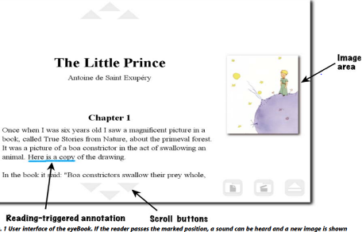

_Figure 1(Biedert, 2010)_

As illustrated in Figure 1, the eyeBook interface provides an entertaining way to tell stories, and the technology may be used for information assistance.

### 2.2.4 RSVP on the Go

By utilising the RSVP method mentioned at Section 2.1.1 and based on an open source framework2, developed an Android Wear RSVP application for the Motorola Moto 360 smartwatch to conduct a research study (Dingler, 2016). Moto 360 runs Android (version 6.0.1) and has a 46 mm thick, 1.56-inch touchscreen display. The repeated-measures design had RSVP control mode as the independent variable, leading to two conditions: 1) manual control, tapped, and 2) implicit control, eye gazed (Dingler, 2016).

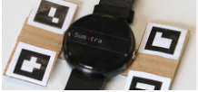

_Figure 2(Dingler, 2016) The RSVP reading interface includes four visual markers enhancing the smartwatch that can detect eye gaze directed toward the watch_

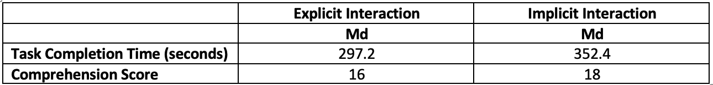

_Table 1(Dingler, 2016)_

According to Table 1, the median comprehension score for the eye gaze (implicit) interaction (Md = 18) exceeded the median comprehension score for the tap (explicit) interaction (Md = 16) (Dingler, 2016). Participants therefore demonstrated better comprehension when the device was implicitly controlled. It seems that eye gaze interaction is less distracting than an explicit touch interaction since comprehension was higher when implicit interaction was used. This confirms that the eye tracker controlling the device by indirect intention is successful. Be that as it may, those participants who read with implicit control, spent 55 more seconds on the task, which may explain the additional comprehension that they received from the read text.

## 2.3 Accessibility with Eye Tracking

### 2.3.1 Tobii Dynavox

Tobii Dynavox helps people with communication and mobility challenges live richer and more meaningful lives. Whether it is an assistive technology device, a communication application, eye gaze control of your computer, materials of low technology or tailored solutions to customer&#39;s needs, Tobii Dynavox is committed to developing top-quality products.

Using Dynavox, individuals who are unable to speak or use a hand or body part in a controlled manner can write messages with only their eyes and have the computer read them aloud (Gosmanova, 2017). Also, it is possible to control appliances such as TVs, air conditioners, and even doors with the help of infrared remote controls for those with limited mobility. People who have trouble moving, such as those with Parkinson&#39;s disease, can operate appliances with their gaze. A teacher, parent or assistant can use an eye tracker and App like Gaze Viewer to find out where someone is looking, or is not looking, on a screen and start conversation based on that.

### 2.3.2 Tobii EdTech

EdTech designs and builds devices that are integrated into computers and provide features such as tracking screen time and posture with accuracy. An education PC designed to enable computers to sense and understand the user through its integrated hardware by tracking head placement and attention to identify issues such as poor body posture and excessive screen time(Henderek, 2021). Hence, if the user becomes focused on work for too long, Tobii&#39;s Artificial Intelligence (AI) will tell them it is time to relax and take breaks. If the user does not take enough breaks, which will cause fatigue and headaches, Tobii will let them know. With every device, EdTech aims to optimise the user experience based on a deep understanding of student attention and intent (Nilsson Benfatto, 2016).

## 2.4 Eye Tracking Without a Dedicated Eye Tracking Device

### 2.4.1 SeeSo

SeeSo captures data from front-facing cameras of mobile devices, tablets, and webcams. Data collection of eye-tracking data will improve their services on their products in which ADHD, Autism, and Dementia sufferers can benefit. With SeeSo, users can click and scroll just by moving their eyes.

Visual Camp is responsible for the Software Development Kit of SeeSo, an artificial intelligence-powered eye-tracking system. SeeSo has a 30-day trial free for developers. Also, developers can extend their trial period anytime, and so, SeeSo reaches a much broader audience.

### 2.4.2 GazeRecorder

Using a webcam, GazeRecorder records a video of the user&#39;s eye movements. The eye movements of the user are displayed as heatmap data in the video frames during the recording, indicating their eye movements as they perform a specific task on their laptop or PC.

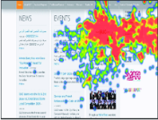

_Figure 3(Y. Othman, 2020 )_

Figure 3 is a heatmap that shows gaze data as colours on the screen. Presently, heatmaps can be created using webcams and eye-tracking software. For acquiring the eye-gaze locations, the gaze coordinates found in every frame of the heatmap will be needed (Y. Othman, 2020 ).

### 2.4.3 EyeWriter

EyeWriter is led by AutoDesk. The system uses a low-cost eye-tracking apparatus and custom software that enables paralysed graffiti writers to draw with only their eyes. The user can also move their head slightly when using the system making it more reliable in situations. Commercial eye trackers cost between $200 and $20,000. With a price tag of $200, the EyeWriter product is affordable, allowing it to reach a larger audience (Anderson, 2013).

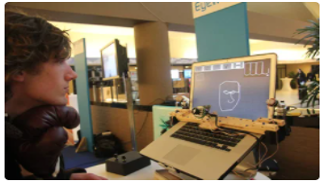

_Figure 4(Anderson, 2013)_

Figure 4 shows LEDs (Light Emitting Diodes) are used for the sides and the centre of the display. Modifying the PS3 eye camera to get the vertical sync (the moment the frame is taken) and to make it sensitive to IR (infra-red). IR light is bouncing off the back of the person&#39;s eye, like the red-eye effect, for which, the system can observe where the person is looking on the display. Building an Arduino/circuit to control the blinking of the LEDs. And finally, a software to setup the base of the system.

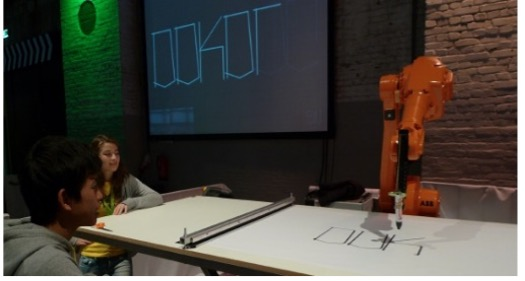

_Figure 5 (Watson, 2010)_

In Figure 5, AutoDesk shows that the EyeWriter even has a robotic arm attached so that it can draw what people see with their eyes.

## 2.5 Eye Tracking Technology

### 2.5.1 Outline

For accurate gaze direction measurement, an infrared light source is essential along with a detection mechanism (i.e., camera) to distinguish the pupil and to detect corneal reflection. Using regular light sources (with a web camera/ mobile phone cameras etc) is difficult because the contrast of parts of the eye are not differentiated well enough. Consequently, the task of precisely measuring the user&#39;s gaze becomes more challenging.

When reading information or viewing images, the eye tends to fixate and move back and forth. Another term for this is a fixation. Analysing duration, area of gaze, the order in which visual elements are fixated, and the number of times an element is viewed helps to assess the user&#39;s intentions. Hence, eye movements are now widely used to investigate cognitive processes during reading, scene perception, and visual search (Rayner.K, 2009). For that reason, many different fields utilise eye trackers, including marketing, education, psychology, healthcare, and website development.

The eyes are used for perceiving and understanding the world, our nature prevents us from continuously controlling our eye movements. As a result, using gaze to press the screen buttons intentionally can create considerable problems.On the other hand, the best approach is simply to track the user&#39;s eye movements while he or she works on the computer, deduce intentions from their eye movements, and provide help as needed. Now, eye movements are usually closely related to cognitive processes in the brain, so quite a bit can be learned using eye tracking methods. Therefore, the cognitive processes of understanding regarding the currently read text can be determined by interpreting eye movements.

This section of the literature review will cover eye tracking dedicated devices. The Eye Tracking Devices from Tobii will be used as a demonstration of the devices eye tracking has to offer. Towards the end of this section, there is a DIY eye tracker example followed by the eye tracker used for this project and a conclusion.

### 2.5.2 Glasses

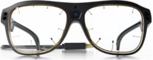

_Figure 6 (Tobii, n.d)_

Figure 6 is the Tobii Pro Glasses 3 and features a discreet, lightweight design and therefore looks like regular eyewear. The cost of this product is over $10,000 (Farnsworth, 2019).These glasses contain a camera for each eye and infra-red illuminators as well as a microphone. It is possible to use the glasses with any Windows/Mac OS or Android device, meaning more people will have an opportunity to learn about the product. Using the slippage compensation technology and consistent calibration, precise and consistent gaze tracking data is maintained throughout recordings, regardless of whether the glasses are taken off and on or moving on the participant&#39;s head. In other words, several algorithms and technologies are used to ensure that the glasses work without worry for the user.Additionally, these glasses can be synchronized with other devices, such as motion capture systems, heart rate, and respiration rate monitors. This opens possibilities for a larger range of subjects such as psychology, health.

### 2.5.3 Monitor and Eye Tracker Unit

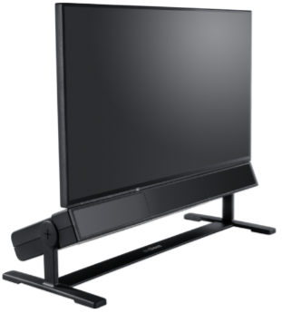

_Figure 7 (Tobii, n.d)_

Figure 7 is the Tobii Pro Spectrum. There is a display component and an eye tracker component in this device that can be used together or separately. The cost of this product is over $10,000 (Farnsworth, 2019). The eye tracker unit will be the subject of focus. The eye tracker unit is larger than the glasses previously mentioned. Due to its superior, more accurate eye tracking software, infrared sensors, a camera with a frame rate of 1200 frames per second, the eye tracker unit is far more capable system. Hence, among the many applications are psychology, developmental studies, neuroscience, reading research, and ophthalmology.

### 2.5.4 Camera

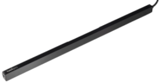

_Figure 8 (Tobii, n.d)_

Figure 8 is the Tobii Pro Fusion, a screen-based tracker. Easy to install, the Tobii Pro Fusion connects to a computer and synchronises with the monitor. The cost of this product is over $10,000 (Farnsworth, 2019).With infrared lights and a camera to translate gaze accurately into display locations. The device&#39;s design is discrete and thus unnoticeable, meaning it can be ideal for disciplines such as psychology and neuroscience, when the devices are not to be touched by patients (i.e., children or those diagnosed with autism or schizophrenia). Another application for this device can be seen in consumer applications, such as for gamers, readers, and people who wish to use their devices with their eyes. Thus, Tobii Pro Fusion is very versatile **.**

### 2.5.5 DIY Eye Tracker

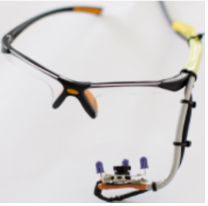

_Figure 9 (Tobii, n.d)_

Figure 9 essentially is a goggles frame with a web camera built onto its capture module that utilises three infrared-photodiodes to illuminate the eye(Mantiuk, 2012). To enable unobstructed vision with the infrared photodiodes, the chassis of the camera is removed and the infrared light blocking filter is replaced with a visible light blocking filter.

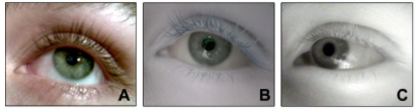

_Figure 10 (Mantiuk, 2012)_

Figure 10A is an image captured by a regular web camera. Figure 10B shows the camera with the settings edited to make the pupil more visible. Figure 10C is the modified web camera without the infrared light blocking filter and with visible light blocking filter. Notice that the dark pupil is very clearly visible in the rightmost image (Mantiuk, 2012).

Upon assembly, the eye tracker can be connected to any computer and run with eye tracking software that utilises the camera. In this way, an eye tracker can be built within a thirty pounds budget.

### 2.5.6 Tobii Eye Tracker 5

_Figure 11 (Tobii, 2020)_

Figure 11 shows an eye tracking camera that is ideal for computer use. The product is non-intrusive and easy to connect to Microsoft Windows computers. The Tobii Stream Engine provides a free platform development kit to build applications with the Tobii Eye Tracker 5, making it available to a wide audience of developers. Considering that Eye Tracker 5 costs £229, it is affordable, and it can both be used for gaming and productivity.

### 2.5.7 Summary

Since the release of eye gaze tracking devices, a vast number of innovative applications have been possible. These devices can lead to unprecedented possibilities in many fields. Among the fields are gaming, accessibility, psychology, developmental studies, neuroscience, reading research, and ophthalmology. There are many ways to use eye gaze tracking in assistive technologies. Eye tracking devices can be used by consumers as well as professionals.

# 3 References

Anderson, D. P. E. B. J. S. M. a. C. R., 2013. The EyeWriter.. p. 1.

Angele, B. R. K., 2013. Processing the in the parafovea: Are articles skipped automatically?. _Journal of Experimental Psychology: Learning, Memory, and Cognition,_ Issue 39, pp. 649-662.

Biedert, R. B. G. &amp;. D. A., 2010. The eyeBook – Using Eye Tracking to Enhance the Reading Experience. Informatik Spektrum. _Informatik Spektrum,_ Volume 33, pp. 273-274.

Carver, R. P., 1990. Reading rate: A review of research and theory. _San Diego, CA: Academic Press._

Dingler, T. a. R. R. a. S. V. a. H. N., 2016. RSVP on the Go: Implicit Reading Support on Smart Watches through Eye Tracking. _Association for Computing Machinery,_ pp. 116-119.

Farnsworth, B., 2019. _Eye Tracker Prices – An Overview of 20+ Eye Trackers,_ s.l.: IMOTIONS.

Forster, K., 1970. Visual perception of rapidly presented word sequences of varying complexity. _Perception &amp; Psychophysics,_ Issue 8, pp. 215-221.

Gosmanova, K. C. C. G. D. F. K. Z. B. Z. D. W. J. M. O. B. A. a. V. T., 2017. EEG-based brain-computer interface access To Tobii Dynavox Communicator 5. _Rehabilitation Engineering and AssistiveTechnology Society of North America,_ Volume 4, p. 2.

Hayatun, N., 2019. The Effectiveness Using An Application ReaderPro Through Reading Skill in Intensive Reading Learning.. _Academia,_ p. 6.

Henderek, D., 2021. _Digital wellbeing in EdTech — reimagining devices for students,_ s.l.: The Tobii Blog.

Mantiuk, R. &amp;. K. M. &amp;. N. A. &amp;. B. B., 2012. Do-It-Yourself Eye Tracker: Low-Cost Pupil-Based Eye Tracker for Computer Graphics Applications.. _Lecture Notes in Computer Science (Proc. of MMM 2012),_ pp. 7131, 115-125.

Masson, M. E. J., 1986. Comprehension of rapidly presented sentences: The mind is quicker than the eye. _Journal of Memory and Language,_ Issue 25, p. 588–604.

Mihwa Chung, P. N., 2006. The effect of a spead reading course. _ENGLISH TEACHING,_ 61(4), pp. 181-182.

Nation, P., 2005. Reading Faster. _PASAA,_ Volume 36, p. 24.

Nilsson Benfatto, M. Q. S. G. Y. J. P. T. R. A. a. J., 2016. Screening for dyslexia using eye tracking during reading. _PLOS ONE,_ Volume 11, pp. 1-16.

Potter, M. C., 1993. Rapid serial visual presentation (RSVP): A method for studying language processing. _New methods in reading comprehension research,_ pp. 91-118.

Potter, M. C. K. J. F. H. C., 1980. Comprehension and memory in rapid sequential reading. _In Nickerson, R. S. (Ed.), Attention and performance,_ Volume III, p. 395–418.

Rayner.K, 2009. The 35th Sir Frederick Bartlett Lecture: Eye movements and attention in reading, scene perception, and visual search.. _Quarterly journal of experimental psychology,_ pp. 62(8), pp.1457-1506.

Rayner, K., 2009. Eye movements and attention in reading, scene perception, and visual search. _Quarterly journal of experimental psychology,_ Volume 62, p. 1457–1506.

Rayner, K. e. a., 2016. So Much to Read, So Little Time: How Do We Read, and Can Speed Reading Help?. _Psychological Science in the Public Interest,_ 1(17), p. 4.

Tobii, n.d. _Tobii Pro._ [Online]
Available at: https://www.tobiipro.com/product-listing/
[Accessed 02 January 2022].

Watson, T., 2010. _F.A.T Lab._ [Online]
Available at: http://fffff.at/eyewriter-2-0-robot-arm-livewriter/
[Accessed 2 January 2021].

Y. Othman, M. K. A. R. A. S. R. A. a. N. S., 2020 . Eye-To-Eye: Towards Visualizing Eye Gaze Data. _International Conference Information Visualisation,_ IV(24), p. 733.

# 4 Interim Progress Report

## 4.1 Picture of the Eye Tracker

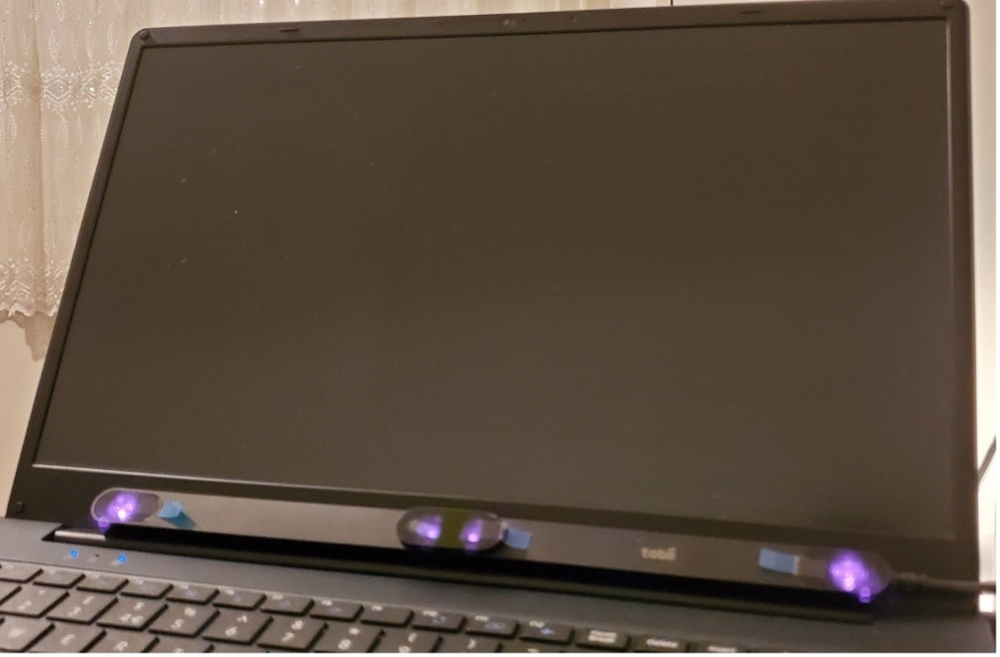

Using the infrared lights and cameras, the eye tracker detects where the eye is looking on the computer screen using an image of the eye tracker.

## 4.2 Website and Current reader

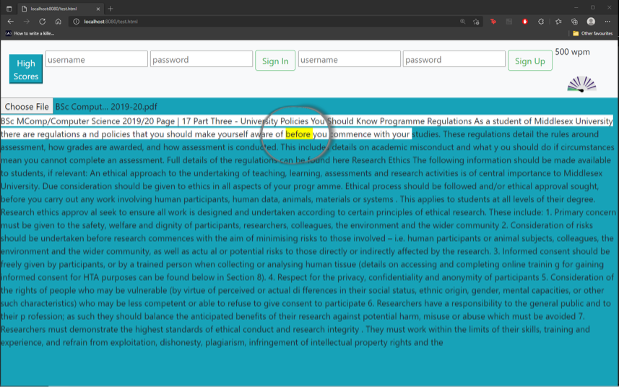

Above is a screenshot of the application in action, where the eye tracker is dragging the mouse and highlighting portions of the text as the user reads. Using the speed metric meter on the top right, the user can see their reading speed. In addition, the user can register and log in to receive their reading speed score.

## 4.3 Database Design

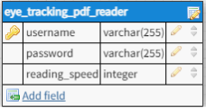

Above is the database design. The table includes a reading speed column to ensure that the user&#39;s progress is saved onto the database. The username is the primary key because there was no need to complicate the database with a &#39;user_id&#39;. To categorise users based on their reading speed, a separate table could be created.

## 4.4 Literature Review and Research

It allowed me to learn a great deal about eye tracking technology (both its current and future applications) and comprehension testing methods.
